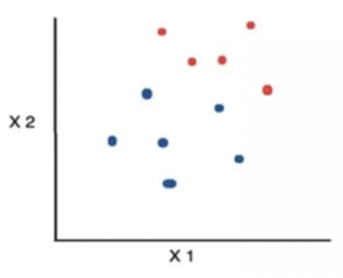
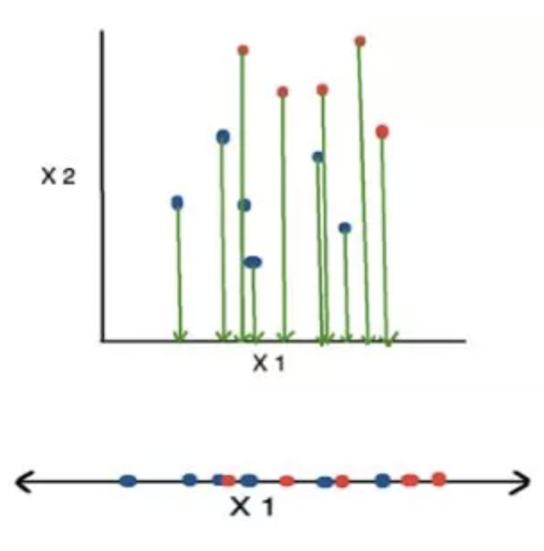
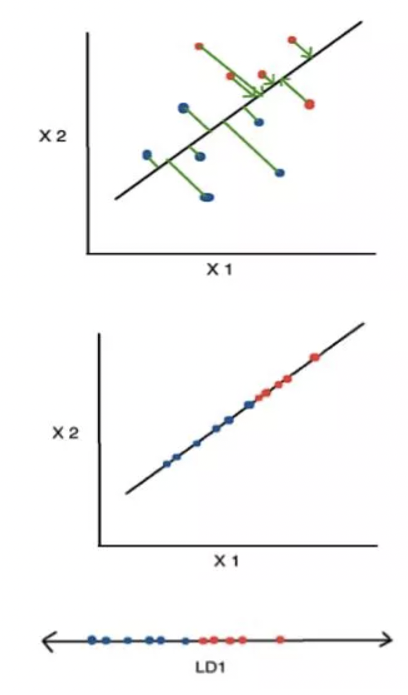

### Differences between classification and clustering 

Two methods to teach machines how to organise new data by one or more features. 

The difference between classification and clustering is that classification is used in supervised learning technique where predefined labels are assigned to instances by properties. Clustering is used in unsupervised learning where similar instances are grouped, based on their features or properties.

#### Examples
###### Netflix
A well-known application of clustering algorithms are Netflix recommendation systems. Although the company is quite discreet with its algorithms, it is confirmed that there are about 2,000 clusters or communities that have common audiovisual tastes. Cluster 290 is the one that includes people who like the series "Lost", "Black Mirror" and "Groundhog Day". Netflix uses these clusters to refine its knowledge of the tastes of viewers and thus make better decisions in the creation of new original series.

###### Fraud Detection
Classification is commonly used in the financial sector. In the era of online transactions where the use of cash has decreased markedly, it is necessary to determine whether movements made through cards are safe. Entities can classify transactions as correct or fraudulent using historical data on customer behavior to detect fraud very accurately.

A form of classification is Linear Discriminant Analysis. 

 

### Linear Discriminant Analysis (LDA)

Logistic regression is a classification algorithm traditionally limited to only two-class classification problems. Whereas, if you have more than two classes then Linear Discriminant Analysis is the preferred linear classification technique. It separates 2 or more classes and models the group-differences in groups by reducing the number of dimensions.

**Consider a situation where you have plotted the relationship between two variables where each color represents a different class. One is shown with a red color and the other with blue**

**If you are willing to reduce the number of dimensions to 1, you can just project everything to the x-axis as shown below: **
.

<

**This approach neglects any helpful information provided by the second feature. However, you can use LDA to plot it. The advantage of LDA is that it uses information from both the features to create a new axis which in turn minimizes the variance and maximizes the class distance of the two variables.**

[Source](https://www.knowledgehut.com/blog/data-science/linear-discriminant-analysis-for-machine-learning)

  

#### Pros & Cons

###### Pros

- It is simple, fast and portable algorithm. It still beats some algorithms (logistic regression) when its assumptions are met.

###### Cons

- It requires normal distribution assumption on features/predictors.
- Sometimes not good for few categories variables.

 

#### Examples

###### Face Recognition  
LDA is used in face recognition to reduce the number of attributes to a more manageable number before the actual classification. The dimensions that are generated are a linear combination of pixels that forms a template. These are called Fisher’s faces.

###### Medical 
You can use LDA to classify the patient disease as mild, moderate or severe. The classification is done upon the various parameters of the patient and their medical trajectory. 

 

 